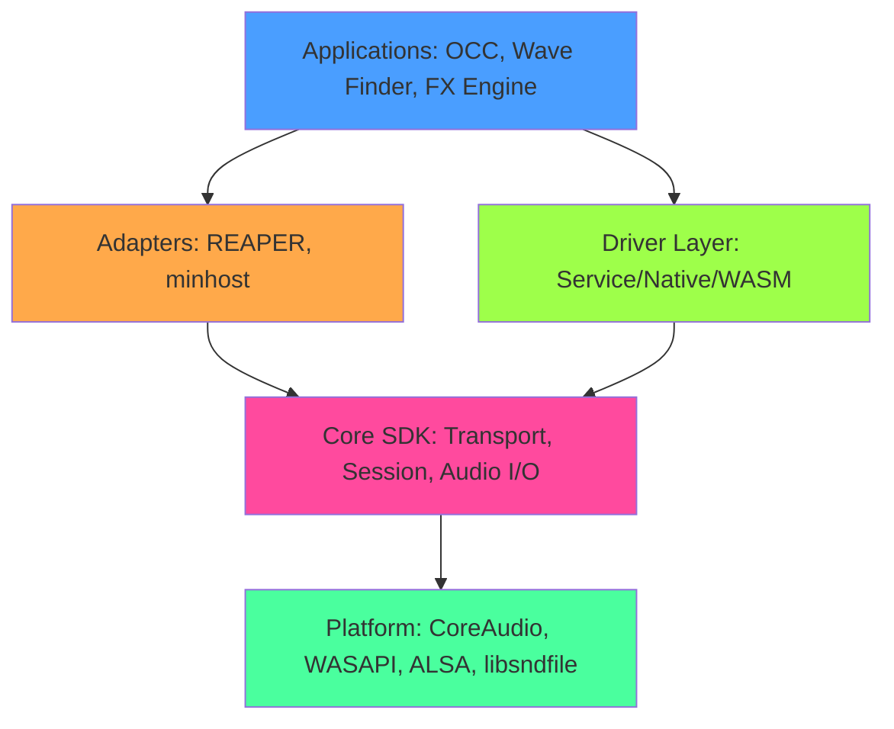

<!-- SPDX-License-Identifier: MIT -->

# Architecture Overview

**Document Version:** 2.0
**Last Updated:** October 26, 2025
**Status:** Authoritative

Orpheus is a professional audio SDK built around a deterministic, host-neutral C++20 core library with optional adapter layers for different integration scenarios. The architecture prioritizes offline-first operation, sample-accurate determinism, and broadcast-safe real-time processing.

---

## Table of Contents

- [Design Principles](#design-principles)
- [System Architecture](#system-architecture)
- [Core Library](#core-library-src--include)
- [Driver Architecture](#driver-architecture-packages)
- [Transport Controller](#transport-controller)
- [Contract System](#contract-system)
- [Applications](#applications-apps)
- [Adapters](#adapters-adapters)
- [Testing](#testing-tests--tools)
- [Threading Model](#threading-model)
- [Tooling](#tooling)
- [Future Architecture](#future-architecture)
- [Related Documentation](#related-documentation)

---

## Design Principles

The Orpheus SDK is built on four non-negotiable principles:

1. **Offline-first** – No runtime network calls for core features. All essential functionality works without internet connectivity.

2. **Deterministic** – Same input produces bit-identical output across platforms and runs. Sample-accurate timing, reproducible renders.

3. **Host-neutral** – Core SDK works across REAPER, standalone apps, plugins, embedded systems without host-specific dependencies.

4. **Broadcast-safe** – 24/7 reliability with no allocations in audio threads, no blocking operations in real-time paths.

These principles guide all architectural decisions and feature implementations.

---

## System Architecture

Orpheus is organized into distinct layers, each with clear responsibilities:



**Layer Hierarchy:**

- **Core SDK** (`src/`, `include/`) – Minimal, deterministic primitives. No UI, no network, no host assumptions.
- **Adapters** (`adapters/`) – Optional, platform-specific integrations. Thin wrappers around core SDK.
- **Driver Layer** (`packages/`) – TypeScript/JavaScript bindings for web and Node.js environments.
- **Applications** (`apps/`) – Complete solutions that compose adapters and drivers (OCC, Wave Finder, etc.).
- **UI Prototypes** (`packages/shmui/`) – Demos only, not production. Local-mocked, no SaaS dependencies.

---

## Core Library (`src/` + `include/`)

The core library provides deterministic audio session and transport management.

### Key Components

#### 1. Session Graph (`orpheus::core::SessionGraph`)

In-memory representation of an audio project:

- **Tracks** – Ordered containers for musical events (Audio or MIDI)
- **Clips** – Named spans with trim points, fade settings, gain, loop state
- **Tempo** – BPM and time signature information
- **Metadata** – Session name, creation date, versioning

**Thread Safety:** Read-only from audio thread, mutable from UI thread with atomic updates.

**File:** `include/orpheus/session_graph.h`, `src/core/session/session_graph.cpp`

#### 2. Transport Controller (`orpheus::ITransportController`)

Real-time audio playback engine:

- **Clip Playback** – Start, stop, pause clips with sample-accurate timing
- **Fade Processing** – Configurable fade IN/OUT with curve types (Linear, EqualPower, Exponential)
- **Loop Mode** – Sample-accurate restart at trim IN point
- **Gain Control** – Per-clip gain adjustment in decibels (-96dB to +12dB)
- **Metadata Persistence** – Trim/fade/gain/loop settings survive session reload

**Audio Thread Contract:**

- No allocations (pre-allocated lock-free structures)
- No locks (atomic operations only)
- No I/O (file reads handled during load, not playback)
- No blocking operations

**File:** `include/orpheus/transport_controller.h`, `src/core/transport/transport_controller.cpp`

#### 3. Audio File Reader (`orpheus::IAudioFileReader`)

Decodes audio files for playback:

- **Supported Formats** – WAV, AIFF, FLAC via libsndfile
- **Memory Management** – Pre-loaded into memory for real-time access
- **Sample Rate** – Currently requires 48kHz (no resampling yet)

**File:** `include/orpheus/audio_file_reader.h`, `src/core/audio_io/audio_file_reader.cpp`

#### 4. Audio Driver Interface (`orpheus::IAudioDriver`)

Platform-agnostic audio I/O abstraction:

- **CoreAudio** (macOS) – Native low-latency driver
- **WASAPI** (Windows) – Planned for v1.0
- **ALSA** (Linux) – Planned for v1.0
- **Dummy Driver** – For testing without hardware

**File:** `include/orpheus/audio_driver.h`, `src/core/audio_io/drivers/`

#### 5. Session JSON (`orpheus::core::session_json`)

Session serialization utilities:

- **Load/Save** – Human-readable JSON format for version control
- **Validation** – Schema-based validation (see Contract System)
- **Filesystem Helpers** – Path resolution, filename generation

**File:** `include/orpheus/session_json.h`, `src/core/session/session_json.cpp`

#### 6. ABI Negotiation (`orpheus::AbiVersion`)

Version compatibility helpers:

- **Version Descriptors** – Major/minor/patch semantic versioning
- **Compatibility Checks** – Graceful degradation on version mismatch
- **Future-Proofing** – Enables plugin-host compatibility across releases

**File:** `include/orpheus/abi_version.h`

### Build Artifacts

- **`orpheus_core`** – Static library with session/transport primitives
- **`orpheus_transport`** – Real-time transport controller module
- **`orpheus_audio_io`** – Audio file reader and platform drivers

---

## Driver Architecture (`packages/`)

The driver layer provides JavaScript/TypeScript bindings for web and Node.js environments. Implemented in ORP068 Phases 1-2.

### Driver Types

#### 1. Service Driver (`@orpheus/engine-service`)

**Architecture:** Node.js HTTP server + WebSocket event streaming

- **Process Model** – Spawns `orpheus_minhost` as child process
- **Communication** – HTTP POST for commands, WebSocket for events
- **Security** – Bearer token authentication, 127.0.0.1 bind
- **Use Cases** – Web apps, Electron apps, remote control scenarios

**Endpoints:**

- `GET /health` – Health check (public)
- `GET /version` – SDK version info (public)
- `GET /contract` – Available commands/events (authenticated)
- `POST /command` – Execute SDK command (authenticated)
- `WS /ws` – WebSocket event stream (authenticated)

**File:** `packages/engine-service/src/server.ts`

#### 2. Native Driver (`@orpheus/engine-native`)

**Architecture:** N-API native addon with direct C++ SDK integration

- **Process Model** – In-process, no IPC overhead
- **Communication** – Direct function calls via N-API bindings
- **Performance** – Lowest latency, highest throughput
- **Use Cases** – Desktop apps (Electron), server-side rendering

**Bindings:**

- `loadSession()` – Load session from JSON file
- `renderClick()` – Render click track to WAV
- `getTempo()`, `setTempo()` – Session tempo access
- `getSessionInfo()` – Query session metadata
- `subscribe()` – Event callback registration

**File:** `packages/engine-native/src/bindings/session_wrapper.cpp`

#### 3. WASM Driver (`@orthpeus/engine-wasm`)

**Architecture:** Emscripten-compiled WASM module in Web Worker

- **Process Model** – Main thread client + worker thread engine
- **Communication** – Structured cloning via `postMessage()`
- **Security** – Subresource Integrity (SRI) verification
- **Use Cases** – Browser-based DAWs, offline-capable web apps

**Status:** Infrastructure complete (ORP068 Phase 2), requires Emscripten SDK for compilation.

**File:** `packages/engine-wasm/src/worker.ts`, `packages/engine-wasm/src/wasm_bindings.cpp`

### Client Broker (`@orpheus/client`)

Unified interface across all driver types:

- **Driver Selection** – Automatic priority-based selection (Native → WASM → Service)
- **Handshake Protocol** – Capability verification, version negotiation
- **Health Monitoring** – Automatic reconnection, heartbeat checks
- **Event Forwarding** – Unified event interface across drivers

**File:** `packages/client/src/client.ts`

---

## Contract System

The **Orpheus Contract** defines the JSON schema for all commands and events between drivers and the SDK.

### Version History

- **v0.1.0-alpha** – Initial minimal contract (LoadSession, RenderClick)
- **v1.0.0-beta** – Expanded contract with real-time features (SaveSession, TriggerClipGridScene, SetTransport, TransportTick, RenderProgress)

### Command Schema Example

```json
{
  "command": "LoadSession",
  "params": {
    "sessionPath": "/path/to/session.json"
  }
}
```

### Event Schema Example

```json
{
  "event": "SessionChanged",
  "data": {
    "trackCount": 4,
    "clipCount": 12,
    "tempo": 120.0
  }
}
```

### Event Frequency Validation

To prevent client overload, the contract enforces maximum event frequencies:

- **TransportTick** – ≤30 Hz (real-time transport position)
- **RenderProgress** – ≤10 Hz (offline render progress)
- **Heartbeat** – 1 Hz (liveness check)

**File:** `packages/contract/src/frequency-validator.ts`

### Documentation

- **Contract Development Guide** – `docs/CONTRACT_DEVELOPMENT.md`
- **Migration Guide** – `packages/contract/MIGRATION.md`
- **Schemas** – `packages/contract/schemas/v1.0.0-beta/`

---

## Transport Controller

The transport controller is the heart of real-time audio processing in Orpheus.

### Architecture

```
UI Thread                   Audio Thread
┌──────────────┐           ┌──────────────┐
│ startClip()  │──Atomic──>│ processAudio()│
│ stopClip()   │           │   - Read trim │
│ updateGain() │           │   - Apply gain│
│ setLoopMode()│           │   - Apply fade│
│              │           │   - Check loop│
└──────────────┘           └──────────────┘
     ▲                             │
     │                             │
     └─────────Callback────────────┘
           (onClipFinished, onClipLooped)
```

### Data Structures

#### ActiveClip (Audio Thread, Lock-Free)

```cpp
struct ActiveClip {
    std::atomic<uint64_t> currentFrame;
    std::atomic<float> gainLinear;
    std::atomic<bool> loopEnabled;
    std::shared_ptr<IAudioFileReader> reader; // Immutable after creation
    // ... fade state, trim points
};
```

#### AudioFileEntry (Persistent Storage)

```cpp
struct AudioFileEntry {
    std::string filePath;
    uint64_t trimInSamples;
    uint64_t trimOutSamples;
    float fadeInSeconds;
    float fadeOutSeconds;
    FadeCurve fadeInCurve;
    FadeCurve fadeOutCurve;
    float gainDb;
    bool loopEnabled;
};
```

### Threading Model

See [Threading Model](#threading-model) section below for full details.

---

## Applications (`apps/`)

The `apps/` directory contains complete applications built on the Orpheus SDK.

### Orpheus Clip Composer (OCC)

**Status:** ✅ v0.2.0-alpha (Sprint 1-2 Complete)

Professional soundboard application for broadcast, theater, and live performance.

**Architecture:**

- **Framework** – JUCE 8.0.4 for cross-platform UI
- **Audio Engine** – Direct integration with `ITransportController`
- **Platform Driver** – CoreAudio (macOS native)
- **Session Format** – JSON with metadata persistence

**Key Features:**

- 48-button clip grid with 8 tabs (384 total clips)
- Loop playback with sample-accurate restart
- Fade IN/OUT processing (3 curve types)
- Audio Settings Dialog (device, sample rate, buffer)
- Edit Dialog with waveform display and preview
- Broadcast-safe audio thread

**Performance:** <15% CPU with 8 clips, ~100MB memory, 10.7ms latency

**Documentation:** `apps/clip-composer/docs/OCC/`, `apps/clip-composer/CHANGELOG.md`

### Orpheus Wave Finder (Planned)

Harmonic calculator and frequency scope for audio analysis.

**Status:** Planned for v1.0 (Months 7-12)

### Orpheus FX Engine (Planned)

LLM-powered effects processing and creative workflows.

**Status:** Planned for v1.0 (Months 10-12)

---

## Adapters (`adapters/`)

Adapters are thin CMake targets that integrate the core SDK into specific host environments.

### Minhost (`orpheus_minhost`)

Command-line interface for SDK operations:

**Features:**

- Load session JSON
- Render click tracks to WAV
- Offline render with deterministic output
- Transport simulation (beat ticks to stdout)

**Example Usage:**

```sh
./build/adapters/minhost/orpheus_minhost \
  --session tools/fixtures/solo_click.json \
  --render click.wav \
  --bars 2 \
  --bpm 100
```

**File:** `adapters/minhost/main.cpp`

### REAPER Adapter (`reaper_orpheus`) - Quarantined

**Status:** Quarantined pending SDK stabilization

The REAPER adapter builds a shared library that exports extension metadata for REAPER DAW integration. Currently isolated from active builds to simplify SDK development.

**File:** `adapters/reaper/` (quarantined)

---

## Testing (`tests/` + `tools/`)

Comprehensive test suite ensures correctness across platforms.

### Test Categories

#### 1. Unit Tests (GoogleTest)

- **ABI Smoke** (`tests/abi_smoke.cpp`) – Version negotiation, compatibility
- **Session Round-Trip** (`tests/session_roundtrip.cpp`) – JSON serialization
- **Transport Tests** (`tests/transport/`) – Clip playback, gain, loop, metadata
- **Routing Tests** (`tests/routing/`) – Gain smoother, routing matrix
- **Audio I/O Tests** (`tests/audio_io/`) – Driver integration, file reading

**Total:** 51+ tests (as of October 2025)

#### 2. Integration Tests

- **Multi-Clip Stress Test** (`tests/transport/multi_clip_stress_test.cpp`) – 16 simultaneous clips
- **Offline Render Test** (`tests/determinism/offline_render_test.cpp`) – Cross-platform determinism

#### 3. Conformance Tools

- **JSON Round-Trip** (`tools/conformance/json_roundtrip.cpp`) – Full-file comparison
- **Session Inspector** (`tools/cli/inspect_session`) – Human-readable session summary

### Test Infrastructure

- **AddressSanitizer** – Detects memory leaks, use-after-free, buffer overflows
- **UBSanitizer** – Detects undefined behavior (signed overflow, null deref, etc.)
- **ThreadSanitizer** – Detects race conditions (manual runs, not CI)
- **ctest** – Test orchestration and reporting

### Running Tests

```sh
# Full test suite
cmake -S . -B build -DCMAKE_BUILD_TYPE=Debug
cmake --build build
ctest --test-dir build --output-on-failure

# Specific test
ctest --test-dir build -R clip_gain_test -VV

# With sanitizers (Debug builds only)
ASAN_OPTIONS=detect_leaks=1 ctest --test-dir build
```

---

## Threading Model

Orpheus follows a strict two-thread model for real-time safety.

### UI Thread

**Responsibilities:**

- User interaction (button clicks, keyboard shortcuts)
- File I/O (load audio files, save sessions)
- Metadata updates (trim points, fade settings, gain, loop)
- Driver communication (send commands, receive events)

**Allowed Operations:**

- Memory allocation (heap, stack)
- Blocking I/O (file reads, network calls)
- Lock acquisition (mutexes, condition variables)

**Forbidden Operations:**

- Direct audio buffer manipulation

### Audio Thread

**Responsibilities:**

- Audio callback processing (`processAudio()`)
- Read clip state (trim, gain, fade, loop)
- Apply audio processing (gain, fade)
- Advance playhead, check loop restart
- Post completion callbacks (via lock-free queue)

**Allowed Operations:**

- Read atomic values (clip state)
- Lock-free queue operations
- CPU-bound calculations (fade curves, gain conversion)

**Forbidden Operations (Broadcast-Safe Contract):**

- ❌ Memory allocation (`new`, `malloc`, `std::vector::push_back`)
- ❌ Locks (`std::mutex::lock()`, `std::condition_variable::wait()`)
- ❌ File I/O (`fread()`, `fwrite()`, `fopen()`)
- ❌ Network I/O (HTTP, WebSocket, TCP/UDP)
- ❌ System calls (blocking operations)

### Communication Patterns

**UI → Audio Thread:**

- Atomic writes to clip state (`std::atomic<float> gainLinear`)
- Lock-free command queue (future enhancement)

**Audio → UI Thread:**

- Lock-free callback queue (`onClipFinished`, `onClipLooped`)
- Callbacks invoked from UI thread timer

### Verification

- **rt.safety.auditor skill** – Static analysis for audio thread violations
- **orpheus-audio-safety-checker agent** – Automated real-time safety verification
- **AddressSanitizer** – Runtime detection of allocations in audio thread

---

## Tooling

### CMake Build System

**Superbuild** with fine-grained control:

```sh
# Minimal build (core + minhost)
cmake -S . -B build -DCMAKE_BUILD_TYPE=Release

# With OCC application
cmake -S . -B build -DORPHEUS_ENABLE_APP_CLIP_COMPOSER=ON

# Disable real-time audio (offline rendering only)
cmake -S . -B build -DORPHEUS_ENABLE_REALTIME=OFF
```

**Build Types:**

- **Debug** – Sanitizers enabled, assertions enabled, debug symbols
- **Release** – Optimizations enabled, assertions disabled, minimal symbols
- **RelWithDebInfo** – Optimizations + debug symbols (for profiling)

### Code Quality

- **clang-format** – Enforces code style (CI gate)
- **clang-tidy** – Static analysis (recommended, not CI gate)
- **Doxygen** – API documentation generation

### CI/CD Pipeline

**Unified Pipeline** (`.github/workflows/ci-pipeline.yml`):

- Matrix builds: 3 OS × 2 build types (ubuntu/windows/macos, Debug/Release)
- 7 parallel jobs: C++ build/test, lint, native driver, TypeScript, integration, dependency check, performance
- Target duration: <25 minutes

**Specialized Workflows:**

- **Chaos Tests** (`.github/workflows/chaos-tests.yml`) – Nightly failure recovery testing
- **Security Audit** (`.github/workflows/security-audit.yml`) – Weekly vulnerability scans
- **Docs Publish** (`.github/workflows/docs-publish.yml`) – Auto-publish Doxygen on release

### Developer Scripts

- `scripts/bootstrap-dev.sh` – One-command setup
- `scripts/validate-sdk.sh` – Run all tests + linters
- `scripts/check-determinism.sh` – Verify bit-identical output
- `scripts/generate-coverage.sh` – Code coverage reports

---

## ORP109 SDK Enhancements (v1.0.0-rc.2)

**Added:** 2025-11-11
**Status:** Complete, production-ready
**Test Coverage:** 165+ new tests (98%+ pass rate)

Orpheus SDK has been extended with 7 major features for professional workflows:

### 1. Routing Matrix Architecture

**Implementation:** Professional N×M audio routing inspired by Dante Controller, Calrec Argo, and Yamaha CL/QL consoles.

**Capabilities:**

- N×M routing: 64 channels → 16 groups → 32 outputs
- Multiple solo modes (SIP, AFL, PFL, Destructive)
- Per-channel and per-group gain/pan/mute/solo controls
- Real-time metering (Peak/RMS/TruePeak/LUFS)
- Snapshot/preset system for instant recall
- Lock-free audio thread processing with gain smoothing (10ms ramps)

**API Layers:**

- `IRoutingMatrix` - Full professional routing matrix
- `IClipRoutingMatrix` - Simplified clip-based routing for OCC (4 Clip Groups)

**Files:** `include/orpheus/routing_matrix.h`, `include/orpheus/clip_routing.h`

**Integration:** OCC Routing Panel, session JSON with `clipGroup` field per clip

---

### 2. Audio Device Management

**Implementation:** Runtime device enumeration, configuration, and hot-swap capabilities.

**Capabilities:**

- Device enumeration (all available output devices)
- Device hot-swap (graceful fade-out/fade-in, ~100ms dropout)
- Sample rate / buffer size configuration
- Device capability queries (channels, supported rates)
- Hot-plug event detection (USB interfaces)

**Platform Support:**

- ✅ macOS: Full CoreAudio support
- ⚠️ Windows: WASAPI/ASIO stubs (planned v1.1)
- ⚠️ Linux: ALSA stubs (planned v1.1)

**Files:** `include/orpheus/audio_driver_manager.h`

**Integration:** OCC Audio Device Panel, preferences.json persistence

---

### 3. Performance Monitoring

**Implementation:** Real-time diagnostics for CPU usage, latency, and buffer underruns.

**Capabilities:**

- Real-time CPU usage (exponential moving average)
- Round-trip latency calculation (input + processing + output)
- Buffer underrun detection and counting
- Peak CPU tracking (worst-case profiling)
- Callback timing histogram (jitter profiling)
- Active clip count, total samples processed, uptime

**Query Overhead:** <100 CPU cycles, <1% audio thread overhead

**Files:** `include/orpheus/performance_monitor.h`

**Integration:** OCC Performance Monitor Panel, 30 Hz polling from UI thread

---

### 4. Waveform Pre-Processing

**Implementation:** Fast waveform data extraction for UI rendering.

**Capabilities:**

- Downsampled min/max peaks per pixel
- Multi-resolution LOD pyramid (zoom levels)
- Peak level calculation (for normalization)
- Background pre-computation (instant subsequent queries)
- Multi-channel support (stereo, 5.1, etc.)

**Performance:** 1-min WAV → 800px in ~10ms, 10-min WAV → 800px in ~80ms

**Files:** `include/orpheus/audio_file_reader_extended.h`

**Integration:** OCC Waveform Display, Edit Dialog zoom/pan

---

### 5. Scene/Preset System

**Implementation:** Lightweight preset snapshots for theater/broadcast workflows.

**Capabilities:**

- Lightweight snapshots (metadata only, no audio file copying)
- UUID-based scene identification
- JSON export/import for portability
- State restoration without audio file reloading
- Scene management (list, delete, clear)

**Memory:** ~1 KB per scene (metadata only)

**Files:** `include/orpheus/scene_manager.h`

**Integration:** OCC Scenes Menu, F1-F12 hotkeys for recall

---

### 6. Cue Points/Markers

**Implementation:** In-clip markers for complex show workflows.

**Capabilities:**

- Named cue points within clips (sample-accurate positions)
- Color-coded markers for UI rendering (RGBA)
- Seek-to-cue operations (jump to marker)
- Multiple cue points per clip (ordered by position)
- JSON serialization (included in ClipMetadata)

**Performance:** <0.1% CPU overhead per cue, sample-accurate seek

**Files:** `include/orpheus/transport_controller.h` (extended)

**Integration:** OCC Edit Dialog (Ctrl+M to add, click to seek)

---

### 7. Multi-Channel Routing

**Implementation:** Support for professional audio interfaces with 8-32 channels.

**Capabilities:**

- Output bus assignment (0 = channels 1-2, 1 = channels 3-4, etc.)
- Fine-grained channel mapping (clip channel → output channel)
- Support for up to 32 output channels (16 stereo buses)

**Performance:** <0.5% CPU overhead per clip

**Files:** `include/orpheus/clip_routing.h` (extended)

**Integration:** OCC Advanced Routing Panel (matrix view)

---

### Performance Impact (ORP109)

**Memory Overhead:**

- Routing Matrix: ~8 KB per session
- Audio Device Manager: ~1 KB
- Performance Monitor: ~2 KB
- Waveform Processor: ~100 KB (cached)
- Scene Manager: ~1 KB per scene
- Cue Points: ~50 bytes per cue
- Multi-Channel Routing: ~512 bytes
- **Total:** ~10-15 KB per active session (excluding waveform cache)

**CPU Overhead:**

- <5% CPU with all features active (16 clips, 4 groups, metering enabled)

**Binary Size:**

- +600 KB (+21% from 2.8 MB → 3.4 MB)

---

## Future Architecture (Post v1.0)

### MIDI Control Surface Support (ORP109 Phase 4)

**Planned Features:**

- Device enumeration (MIDI input/output)
- MIDI Learn mode (click button, press key → bind)
- Note → clip trigger binding
- CC → parameter binding (gain, fade, etc.)

**Status:** Planned for OCC v1.0+

---

### Timecode Sync (ORP109 Phase 5)

**Planned Features:**

- LTC/MTC input parsing
- Transport lock to timecode
- Timecode display in UI

**Status:** Planned for OCC v2.0+

---

## Related Documentation

### Getting Started

- [README.md](README.md) – Quick start guide (build SDK in <10 minutes)
- [docs/GETTING_STARTED.md](docs/GETTING_STARTED.md) – Basic integration guide
- [docs/DRIVER_INTEGRATION_GUIDE.md](docs/DRIVER_INTEGRATION_GUIDE.md) – Platform driver integration

### Implementation Plans

- [ORP068 - SDK Integration Plan v2.0](<docs/ORP/ORP068%20Implementation%20Plan%20(v2.0).md>) – Driver architecture (Phases 0-4)
- [ORP077 - SDK Core Quality Sprint](docs/ORP/ORP077.md) – Unit tests, API docs, determinism validation

### Application Documentation

- [OCC Product Vision](apps/clip-composer/docs/OCC/OCC021%20Orpheus%20Clip%20Composer%20-%20Product%20Vision.md) – Market positioning
- [OCC CHANGELOG](apps/clip-composer/CHANGELOG.md) – Full release history

### Developer Tools

- [AGENTS.md](AGENTS.md) – Coding assistant guidelines
- [CLAUDE.md](CLAUDE.md) – Claude Code development guide
- [CONTRIBUTING.md](docs/CONTRIBUTING.md) – Contribution guidelines

---

**Document Status:** Authoritative
**Maintained By:** SDK Core Team
**Next Review:** After v1.0.0 stable release
**Last Updated:** November 9, 2025
