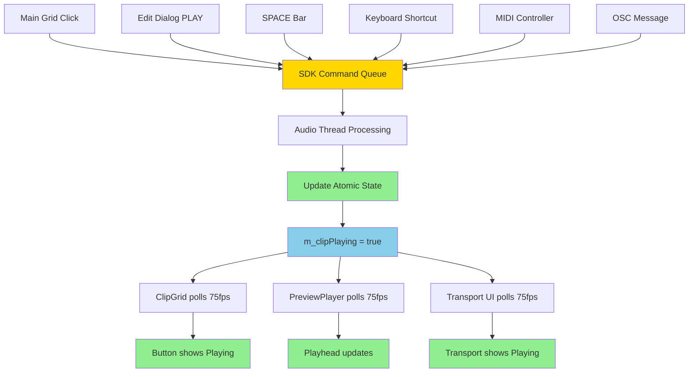
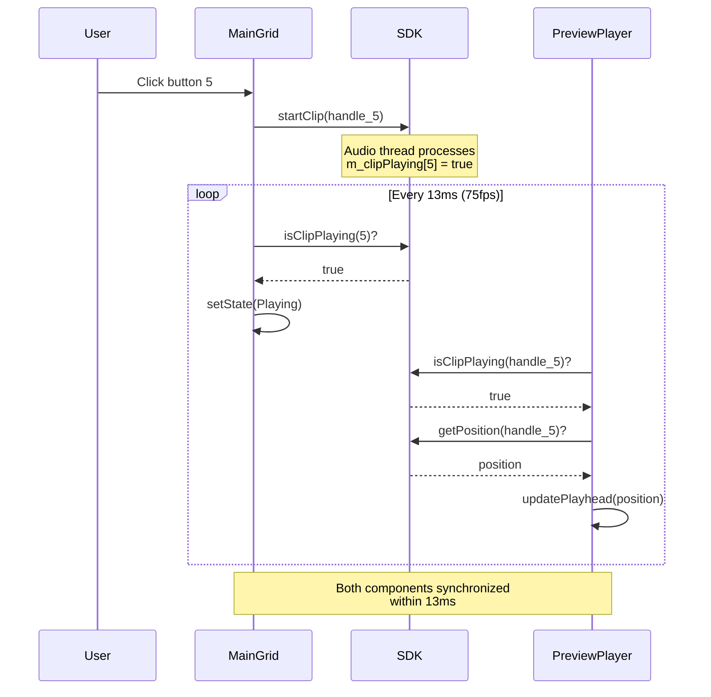
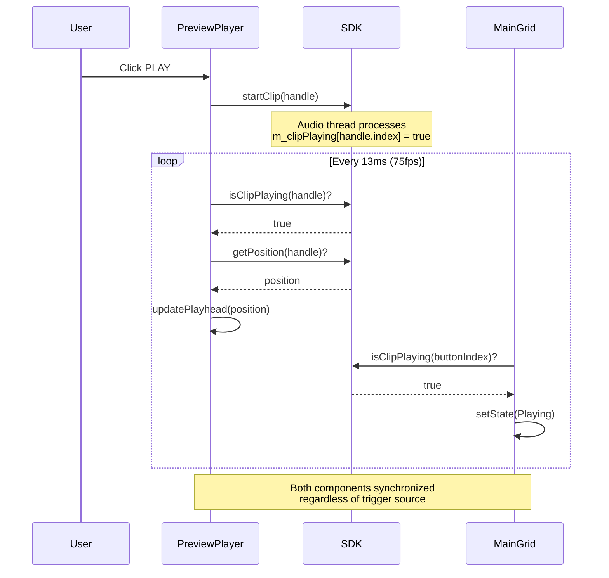

# Multi-Source Triggers - Guaranteed Synchronization

**Status:** Architectural Reference
**Source:** OCC127 State Synchronization Architecture
**Created:** 2025-11-17

---

## Executive Summary

One of the key advantages of continuous polling: clips can be triggered from **any source** and all UI components automatically stay synchronized. No callbacks required, no manual state propagation, no race conditions.

**Guarantee:** All UI components reflect SDK state within 13ms, regardless of trigger source.

---

## Supported Trigger Sources

### Complete List

1. **Main Grid Buttons** - Click or hold clip button
2. **Edit Dialog PLAY** - Transport control in clip editor
3. **SPACE Bar** - Global transport control
4. **Keyboard Shortcuts** - Number keys, I/O keys
5. **MIDI Controllers** - External MIDI devices (future)
6. **OSC Messages** - Network control (future)
7. **API Calls** - Programmatic control (future)

**All sources write to the same SDK atomic state → all UI polls the same state → guaranteed synchronization**

---

## Trigger Flow Diagram

### Multi-Source to Single State



**Key Insight:** All trigger sources converge to single atomic state, all UI polls that state.

---

## Example 1: Grid Button Triggers Clip

### Timeline with Multi-Component Synchronization

```
t=0ms:    User clicks Main Grid button 5
          ↓
          MainComponent::onClipTriggered(5)
          ↓
          AudioEngine::startClip(globalIndex)
          ↓
          TransportController::startClip(handle)
          ↓
          Command queued to audio thread

t=10ms:   Audio thread processes command
          ↓
          m_clipPlaying[handle.index] = true  (atomic write)
          ↓
          onClipStarted callback triggered

t=13ms:   ClipGrid::timerCallback() fires (75fps poll)
          ↓
          bool playing = isClipPlaying(5)  // Reads atomic state
          ↓
          button[5]->setState(Playing)  // Update button visual state
          ↓
          button[5]->repaint()

t=13ms:   PreviewPlayer::timerCallback() fires (if Edit Dialog open for clip 5)
          ↓
          bool playing = isClipPlaying(handle)  // Reads atomic state
          ↓
          int64_t pos = getCurrentPosition()    // Reads atomic position
          ↓
          updatePlayhead(pos)  // Update playhead display

t=26ms:   Next poll cycle - all components show synchronized state
```

**Result:** Both ClipGrid button and Edit Dialog playhead update within 13-26ms, synchronized.

---

## Example 2: Edit Dialog PLAY Triggers Clip

### Reverse Direction Synchronization

```
t=0ms:    User clicks PLAY in Edit Dialog
          ↓
          PreviewPlayer::play()
          ↓
          AudioEngine::startClip(m_clipHandle)
          ↓
          Command queued to audio thread

t=10ms:   Audio thread processes command
          ↓
          m_clipPlaying[handle.index] = true  (atomic write)

t=13ms:   ClipGrid::timerCallback() fires
          ↓
          bool playing = isClipPlaying(buttonIndex)  // Reads atomic state
          ↓
          button[buttonIndex]->setState(Playing)
          ↓
          button[buttonIndex]->repaint()

t=13ms:   PreviewPlayer::timerCallback() fires
          ↓
          bool playing = isClipPlaying(m_clipHandle)  // Reads atomic state
          ↓
          int64_t pos = getCurrentPosition()
          ↓
          updatePlayhead(pos)

t=26ms:   All components synchronized
```

**Result:** Main grid button updates to show Playing state, even though triggered from Edit Dialog.

---

## Example 3: SPACE Bar Stop All

### Global State Change

```
t=0ms:    User presses SPACE bar (Stop All)
          ↓
          MainComponent::keyPressed(KeyPress::spaceKey)
          ↓
          AudioEngine::stopAllClips()
          ↓
          for (int i = 0; i < 384; ++i) {
            TransportController::stopClip(handles[i])
          }
          ↓
          384 Stop commands queued to audio thread

t=10ms:   Audio thread processes commands
          ↓
          for (int i = 0; i < 384; ++i) {
            m_clipPlaying[i] = false  (atomic writes)
          }

t=13ms:   ClipGrid::timerCallback() fires
          ↓
          for (int i = 0; i < 384; ++i) {
            bool playing = isClipPlaying(i)  // All return false
            if (button[i]->getState() == Playing && !playing) {
              button[i]->setState(Loaded)  // Transition all buttons
            }
          }
          ↓
          All 384 buttons repaint showing Loaded state

t=13ms:   PreviewPlayer::timerCallback() fires (if Edit Dialog open)
          ↓
          bool playing = isClipPlaying(m_clipHandle)  // Returns false
          ↓
          Early return (no playhead updates)

t=26ms:   All UI synchronized - no clips playing
```

**Result:** All 384 buttons transition to Loaded state simultaneously, Edit Dialog playhead stops updating.

---

## Sequence Diagrams

### Grid Button → Edit Dialog Sync



### Edit Dialog PLAY → Grid Button Sync



---

## Synchronization Guarantees

### What This Architecture Guarantees

✅ **Multi-Source Guarantee**
- Clips can be triggered from ANY source
- ALL UI components stay synchronized
- No manual state propagation needed
- No callbacks required

✅ **Timing Guarantee**
- UI updates within 13ms of state change
- All components update within same 13ms window
- Deterministic synchronization latency

✅ **State Consistency Guarantee**
- Single source of truth (SDK atomic state)
- No stale caches
- No race conditions between components
- Atomic reads ensure consistent snapshots

✅ **Component Independence Guarantee**
- Components don't need to know about each other
- No direct component-to-component communication
- Add new trigger sources without modifying UI
- Add new UI components without modifying triggers

---

## Comparison: Callback-Based vs Polling-Based

### Callback-Based Synchronization (WRONG)

```
User clicks Main Grid button
          ↓
    startClip(handle)
          ↓
    onClipStarted callback
          ↓
    button->setState(Playing)  ✓
    ───────────────────────────────
    PreviewPlayer NOT notified  ✗
    (Edit Dialog playhead frozen)
```

**Problem:** Callbacks only notify one component, others desynchronize.

**"Solution":** Manually propagate callbacks to all components

```cpp
// BAD: Manual callback propagation
void MainComponent::onClipTriggered(int index) {
  m_audioEngine->startClip(index);

  // Manual propagation - error-prone!
  if (m_currentEditDialog && m_currentEditDialog->getClipIndex() == index) {
    m_currentEditDialog->onClipStarted();  // Easy to forget!
  }

  // What about future components? Have to update this code!
}
```

**Problems:**

- Error-prone (easy to forget components)
- Tight coupling (components must know about each other)
- Not extensible (adding components requires code changes)
- Race conditions (callback order matters)

---

### Polling-Based Synchronization (CORRECT)

```
User clicks Main Grid button
          ↓
    startClip(handle)
          ↓
    m_clipPlaying[i] = true  (atomic write)
          ↓
    ┌──────────────────┬──────────────────┐
    ↓                  ↓                  ↓
ClipGrid polls    PreviewPlayer polls   (Future components poll)
    ↓                  ↓                  ↓
button->setState  playhead updates      auto-synchronized
```

**Benefits:**

- Zero manual propagation
- Components independent
- Extensible (add components without changes)
- No race conditions (single source of truth)

---

## Adding New Trigger Sources

### Example: Adding MIDI Controller Support

**Step 1: Receive MIDI message**

```cpp
void AudioEngine::onMidiMessage(const juce::MidiMessage& msg) {
  // Decode MIDI Note On message
  if (msg.isNoteOn()) {
    int note = msg.getNoteNumber();
    int buttonIndex = midiNoteToButtonIndex(note);

    // Trigger clip - same as any other source
    startClip(buttonIndex);
  }
}
```

**Step 2: Write to SDK state**

```cpp
void AudioEngine::startClip(int buttonIndex) {
  // Convert button index to clip handle
  orpheus::ClipHandle handle = getClipHandle(buttonIndex);

  // Queue command to SDK (same as Grid/Dialog triggers)
  m_transportController->startClip(handle);
}
```

**Step 3: SDK updates atomic state**

```cpp
// SDK audio thread
void TransportController::processStartCommand(ClipHandle handle) {
  // Update atomic state (same code path for all triggers)
  m_clipPlaying[handle.index].store(true, std::memory_order_release);
}
```

**Step 4: All UI automatically synchronized**

```
ClipGrid::timerCallback()
  ↓
  isClipPlaying(buttonIndex) → true
  ↓
  button->setState(Playing)  ✓ Automatically updates!

PreviewPlayer::timerCallback()
  ↓
  isClipPlaying(handle) → true
  ↓
  updatePlayhead(position)   ✓ Automatically updates!
```

**No additional code needed!** All UI components automatically synchronize.

---

## Multi-Source Test Scenarios

### Test Scenario 1: Rapid Source Switching

**Setup:**
- Edit Dialog open for clip 5
- Main grid visible

**Test Steps:**

1. Click PLAY in Edit Dialog → clip 5 starts
   - **Verify:** Grid button 5 shows Playing state
   - **Verify:** Edit Dialog playhead updates

2. Click grid button 5 (re-trigger)
   - **Verify:** Edit Dialog playhead resets to IN point
   - **Verify:** Grid button stays Playing state

3. Press SPACE bar (Stop All)
   - **Verify:** Grid button 5 transitions to Loaded
   - **Verify:** Edit Dialog playhead stops updating

4. Press '5' key (trigger via keyboard)
   - **Verify:** Grid button 5 shows Playing state
   - **Verify:** Edit Dialog playhead starts updating

**Expected Result:** All components stay synchronized regardless of trigger source.

---

### Test Scenario 2: Simultaneous Multi-Clip Triggers

**Setup:**
- Grid with 16 clips loaded
- Edit Dialog open for clip 10

**Test Steps:**

1. Click grid buttons 1, 2, 3, 4 rapidly (within 100ms)
   - **Verify:** All 4 buttons show Playing state
   - **Verify:** Edit Dialog for clip 10 not affected

2. Click PLAY in Edit Dialog (clip 10)
   - **Verify:** Grid button 10 shows Playing state
   - **Verify:** Buttons 1-4 still show Playing state
   - **Verify:** Edit Dialog playhead updates

3. Press SPACE bar (Stop All)
   - **Verify:** All 5 buttons (1, 2, 3, 4, 10) transition to Loaded
   - **Verify:** Edit Dialog playhead stops

**Expected Result:** All components track multiple simultaneous clips correctly.

---

### Test Scenario 3: Edit Dialog Closed/Opened

**Setup:**
- Edit Dialog open for clip 7, clip playing

**Test Steps:**

1. Clip 7 playing, Edit Dialog showing playhead updates
   - **Verify:** Grid button 7 shows Playing
   - **Verify:** Edit Dialog playhead updating

2. Close Edit Dialog (clip continues playing)
   - **Verify:** Grid button 7 still shows Playing
   - **Verify:** Audio continues

3. Open Edit Dialog for clip 7 again
   - **Verify:** Grid button 7 still shows Playing
   - **Verify:** Edit Dialog playhead resumes updating from current position

4. Click grid button 7 (re-trigger)
   - **Verify:** Edit Dialog playhead resets to IN point
   - **Verify:** Both components synchronized

**Expected Result:** Edit Dialog lifecycle doesn't affect synchronization.

---

## Performance with Multiple Trigger Sources

### CPU Overhead Analysis

**Scenario:** 16 clips playing simultaneously, triggered from different sources

```
ClipGrid polling (384 buttons):     0.3% CPU
PreviewPlayer polling (1 dialog):   0.5% CPU
Transport UI polling:               0.1% CPU
─────────────────────────────────────────────
Total polling overhead:             0.9% CPU

Audio processing (16 clips):        8.0% CPU
JUCE UI rendering:                  2.0% CPU
─────────────────────────────────────────────
Total CPU usage:                   10.9% CPU
```

**Conclusion:** Polling overhead is negligible compared to actual audio processing.

---

## Extensibility

### Future Trigger Sources (No Code Changes Required)

**Planned Additions:**

1. **MIDI Controller**
   - MIDI Note On → trigger clip
   - MIDI CC → adjust gain
   - No UI changes needed

2. **OSC Messages**
   - /clip/5/play → trigger clip 5
   - /clip/*/stop → stop all clips
   - No UI changes needed

3. **Timeline/Automation**
   - Automated clip triggers at timecode
   - Playlist mode
   - No UI changes needed

4. **Network Control**
   - Remote control from another machine
   - Multi-user collaboration
   - No UI changes needed

**All work because:** Write to SDK atomic state → All UI automatically synchronized.

---

## Key Takeaways

### Design Principles

1. **Single Source of Truth**
   - SDK atomic state is ground truth
   - UI derives state through polling
   - Never cache state locally

2. **Component Independence**
   - Components don't talk to each other
   - All communicate through SDK state
   - Loosely coupled architecture

3. **Extensibility by Default**
   - Add trigger sources without UI changes
   - Add UI components without trigger changes
   - Scales to arbitrary complexity

4. **Guaranteed Synchronization**
   - All UI polls same atomic state
   - Updates within deterministic time window
   - No race conditions possible

### Anti-Patterns to Avoid

❌ **Manual State Propagation**
```cpp
// BAD: Manually notifying components
void onClipTriggered(int index) {
  m_grid->updateButton(index);          // Manual!
  m_previewPlayer->onClipStarted();     // Manual!
  m_transport->updateState();           // Manual!
  // Easy to forget components!
}
```

✅ **Automatic Polling Synchronization**
```cpp
// GOOD: SDK state + polling = automatic sync
void onClipTriggered(int index) {
  m_sdk->startClip(index);  // Write to atomic state
  // All UI polls and syncs automatically
}
```

---

## Related Documents

- **01-system-overview.md:** High-level architecture
- **02-polling-pattern.md:** Timer lifecycle and early return pattern
- **04-correct-vs-incorrect.md:** Pattern comparisons
- **05-component-interactions.md:** Component implementation details
- **OCC127:** State Synchronization Architecture (source)

---

## References

### Source Code

- **MainComponent:** `apps/clip-composer/Source/MainComponent.cpp:onClipTriggered()`
- **PreviewPlayer:** `apps/clip-composer/Source/UI/PreviewPlayer.cpp:play()`
- **AudioEngine:** `apps/clip-composer/Source/Audio/AudioEngine.cpp:startClip()`
- **TransportController:** `src/core/transport/transport_controller.cpp:startClip()`

### Design Patterns

- **Observer Pattern:** https://en.wikipedia.org/wiki/Observer_pattern (polling is inverted observer)
- **Single Source of Truth:** https://en.wikipedia.org/wiki/Single_source_of_truth

---

**Document Status:** Architectural Reference
**Maintained By:** Orpheus SDK Development Team
**Last Updated:** 2025-11-17
