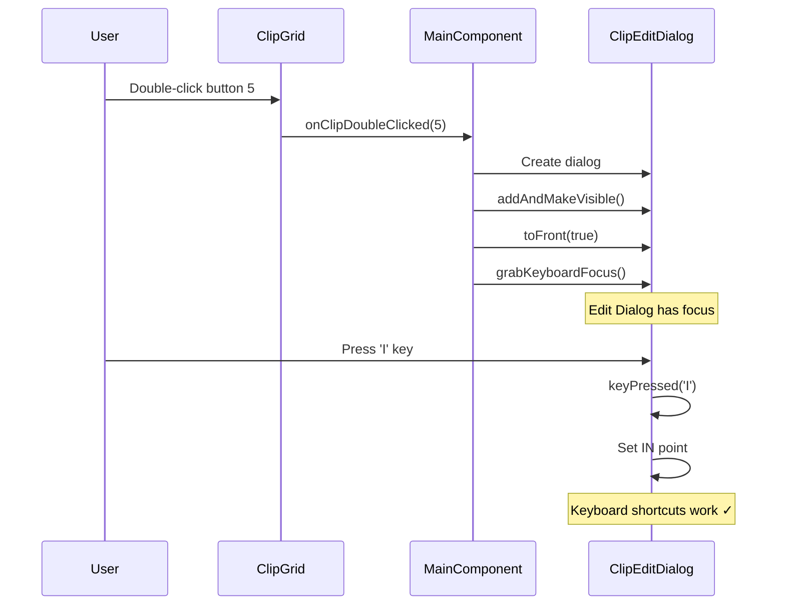
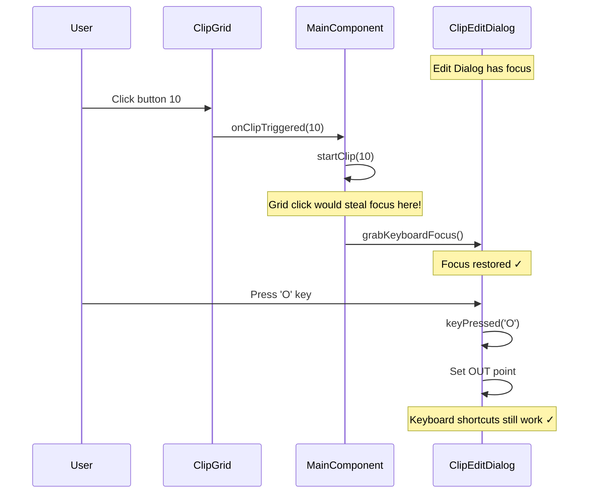
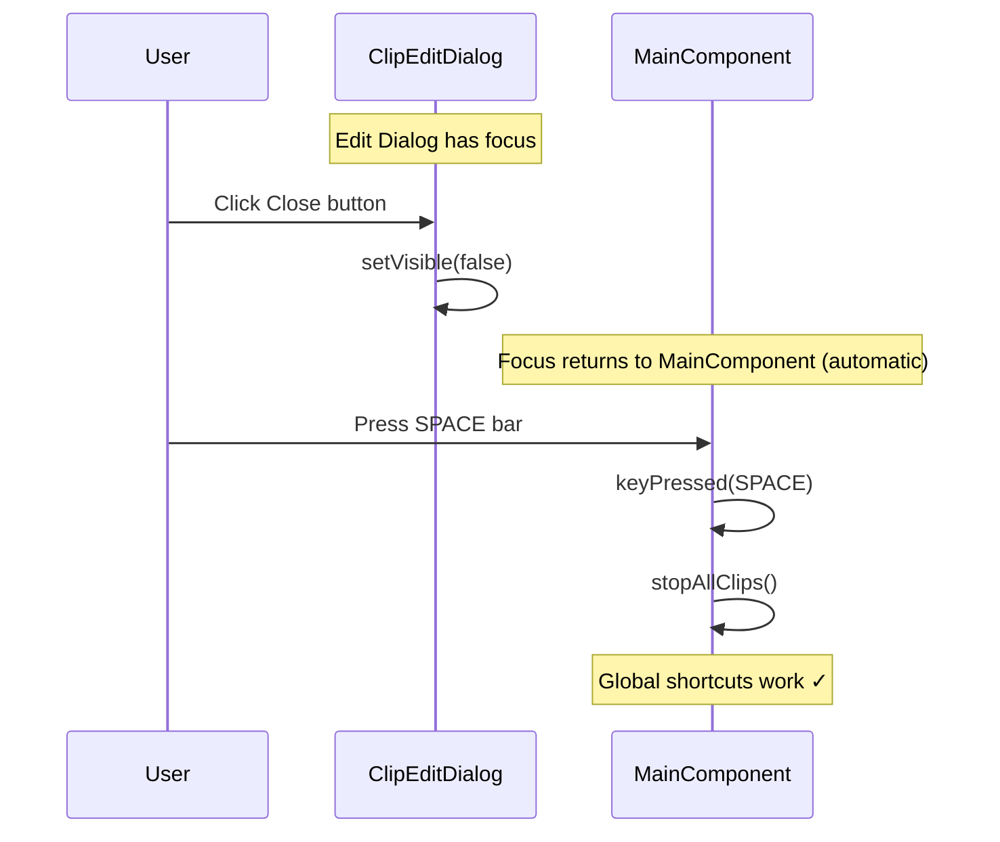

# Keyboard Focus Management - Priority and Flows

**Status:** Architectural Reference
**Source:** OCC127 State Synchronization Architecture
**Created:** 2025-11-17

---

## Executive Summary

Keyboard focus management is **critical** to the continuous polling architecture. Without correct focus handling, Edit Dialog keyboard shortcuts stop working when main grid triggers clips.

**Core Rule:** Edit Dialog has keyboard focus priority when visible. Main grid must restore focus after triggering clips.

---

## Focus Hierarchy

```
┌────────────────────────────────────────────────────────────┐
│                     Focus Priority                         │
├────────────────────────────────────────────────────────────┤
│                                                            │
│  HIGHEST:  ClipEditDialog (when visible)                  │
│            - I/O keys: Set IN/OUT points                   │
│            - L key: Toggle loop                            │
│            - SPACE: Toggle playback (dialog clip only)     │
│            - Arrow keys: Move playhead ±1 sample           │
│            - Cmd+Arrow: Move playhead ±1 second            │
│            - G key: Adjust gain                            │
│                                                            │
│            ↓ (if dialog closed)                            │
│                                                            │
│  MEDIUM:   MainComponent                                   │
│            - SPACE: Stop all clips                         │
│            - Number keys (0-9): Trigger clips              │
│            - Page Up/Down: Switch pages                    │
│            - Escape: Close dialogs                         │
│                                                            │
│            ↓ (if no other component wants focus)           │
│                                                            │
│  LOWEST:   ClipGrid                                        │
│            - Mouse events only (click/hold/double-click)   │
│            - Does NOT handle keyboard events               │
│                                                            │
└────────────────────────────────────────────────────────────┘
```

---

## Focus Management Rules

### Rule 1: Edit Dialog Opens → Grab Focus Immediately

```cpp
void MainComponent::onClipDoubleClicked(int buttonIndex) {
  // Create Edit Dialog
  auto dialog = std::make_unique<ClipEditDialog>(/* ... */);
  dialog->setBounds(/* ... */);
  addAndMakeVisible(dialog.get());

  // ✅ CRITICAL: Grab keyboard focus immediately
  dialog->toFront(true);
  dialog->grabKeyboardFocus();

  m_currentEditDialog = std::move(dialog);
}
```

**Why:** Ensures user can immediately use keyboard shortcuts without clicking in dialog.

---

### Rule 2: Grid Button Clicked → Restore Focus to Dialog

```cpp
void MainComponent::onClipTriggered(int buttonIndex) {
  int globalClipIndex = (m_clipGrid->getCurrentPage() * 16) + buttonIndex;

  // Start clip
  m_audioEngine->startClip(globalClipIndex);

  // ✅ CRITICAL: Restore keyboard focus to Edit Dialog if open
  if (m_currentEditDialog != nullptr && m_currentEditDialog->isVisible()) {
    m_currentEditDialog->grabKeyboardFocus();
  }
}
```

**Why:** Main grid click would otherwise steal focus, breaking Edit Dialog keyboard shortcuts.

---

### Rule 3: Edit Dialog Closes → Focus Returns to Main

```cpp
void ClipEditDialog::closeButtonPressed() {
  // ✅ Focus automatically returns to parent (MainComponent)
  setVisible(false);
  // No explicit grabKeyboardFocus() needed - JUCE handles automatically
}
```

**Why:** JUCE restores focus to parent component when child is hidden.

---

## Focus Flow Diagrams

### Scenario 1: Edit Dialog Opens



---

### Scenario 2: Grid Button Clicked While Dialog Open



**CRITICAL:** Without `grabKeyboardFocus()` in step 4, pressing 'O' would trigger main grid clip instead of setting OUT point!

---

### Scenario 3: Edit Dialog Closes



---

## Keyboard Shortcut Mapping

### Edit Dialog Shortcuts (Priority)

| Key | Action | SDK Call |
|-----|--------|----------|
| **I** | Set IN point | `setClipTrimIn(playheadPosition)` |
| **O** | Set OUT point | `setClipTrimOut(playheadPosition)` |
| **L** | Toggle loop | `setLoopEnabled(!loopEnabled)` |
| **SPACE** | Toggle playback | `startClip()` or `stopClip()` |
| **←** | Move playhead -1 sample | `setPosition(position - 1)` |
| **→** | Move playhead +1 sample | `setPosition(position + 1)` |
| **Cmd+←** | Move playhead -1 second | `setPosition(position - sampleRate)` |
| **Cmd+→** | Move playhead +1 second | `setPosition(position + sampleRate)` |
| **G** | Adjust gain | `setClipGain(newGain)` |
| **Escape** | Close dialog | `setVisible(false)` |

### MainComponent Shortcuts (Fallback)

| Key | Action | SDK Call |
|-----|--------|----------|
| **SPACE** | Stop all clips | `stopAllClips()` |
| **0-9** | Trigger clips 0-9 | `startClip(clipIndex)` |
| **Page Up** | Previous page | `setCurrentPage(page - 1)` |
| **Page Down** | Next page | `setCurrentPage(page + 1)` |
| **Escape** | Close dialogs | (handled by parent) |

---

## Focus Problem: What Goes Wrong Without Restoration

### Timeline Without Focus Restoration

```
Time    Event                               Focus Owner      Result
──────────────────────────────────────────────────────────────────────
0ms     Edit Dialog opens                   Edit Dialog      ✓
        User presses 'I' to set IN point    Edit Dialog      ✓ Works

100ms   User clicks Main Grid button 5      ClipGrid         ✗ Focus stolen!
        (No focus restoration)

200ms   User presses 'O' to set OUT point   ClipGrid         ✗ WRONG!
        MainComponent receives 'O' key      MainComponent    ✗ Triggers clip 'O'!
        (Expected: Set OUT point in dialog)                  ✗ Bug!
```

**Result:** Keyboard shortcuts broken, confusing UX.

---

### Timeline With Focus Restoration (Correct)

```
Time    Event                               Focus Owner      Result
──────────────────────────────────────────────────────────────────────
0ms     Edit Dialog opens                   Edit Dialog      ✓
        User presses 'I' to set IN point    Edit Dialog      ✓ Works

100ms   User clicks Main Grid button 5      ClipGrid         (brief)
        onClipTriggered(5)
        grabKeyboardFocus() called          Edit Dialog      ✓ Focus restored!

200ms   User presses 'O' to set OUT point   Edit Dialog      ✓ CORRECT!
        Edit Dialog receives 'O' key        Edit Dialog      ✓ Sets OUT point
        (Expected behavior)                                  ✓ Works!
```

**Result:** Keyboard shortcuts work as expected.

---

## Implementation Patterns

### Pattern 1: Dialog Opens → Grab Focus

```cpp
void MainComponent::openEditDialog(int clipIndex) {
  // Create dialog
  auto dialog = std::make_unique<ClipEditDialog>(m_audioEngine.get(), clipIndex);

  // Position and show
  dialog->setBounds(getLocalBounds().reduced(20));
  addAndMakeVisible(dialog.get());

  // ✅ CRITICAL: Grab focus immediately
  dialog->toFront(true);        // Bring to front
  dialog->grabKeyboardFocus();  // Grab focus

  m_currentEditDialog = std::move(dialog);
}
```

---

### Pattern 2: Grid Triggers → Restore Focus

```cpp
void MainComponent::onClipTriggered(int buttonIndex) {
  // Route to AudioEngine
  m_audioEngine->startClip(globalClipIndex);

  // ✅ CRITICAL: Check if dialog is open and visible
  if (m_currentEditDialog != nullptr && m_currentEditDialog->isVisible()) {
    // Restore focus to dialog
    m_currentEditDialog->grabKeyboardFocus();
  }
  // If dialog not open, focus stays with MainComponent (correct)
}
```

---

### Pattern 3: Dialog Closes → Automatic Return

```cpp
void ClipEditDialog::closeButtonPressed() {
  // ✅ GOOD: Just hide the dialog
  setVisible(false);

  // JUCE automatically restores focus to parent (MainComponent)
  // No manual focus management needed
}

// In MainComponent:
void visibilityChanged() override {
  // Optional: Clean up dialog reference when hidden
  if (m_currentEditDialog && !m_currentEditDialog->isVisible()) {
    m_currentEditDialog = nullptr;
  }
}
```

---

## Anti-Patterns

### Anti-Pattern 1: No Focus Restoration (WRONG)

```cpp
void MainComponent::onClipTriggered(int buttonIndex) {
  m_audioEngine->startClip(globalClipIndex);
  // ❌ Missing: grabKeyboardFocus()
  // Result: Focus stolen by grid, keyboard shortcuts break
}
```

---

### Anti-Pattern 2: Grabbing Focus for Grid (WRONG)

```cpp
void MainComponent::onClipTriggered(int buttonIndex) {
  m_audioEngine->startClip(globalClipIndex);

  // ❌ WRONG: Giving focus to grid
  m_clipGrid->grabKeyboardFocus();
  // Result: Edit Dialog loses focus, keyboard shortcuts break
}
```

---

### Anti-Pattern 3: Conditional Focus Based on Clip Index (WRONG)

```cpp
void MainComponent::onClipTriggered(int buttonIndex) {
  m_audioEngine->startClip(globalClipIndex);

  // ❌ WRONG: Only restoring focus if same clip
  if (m_currentEditDialog && m_currentEditDialog->getClipIndex() == globalClipIndex) {
    m_currentEditDialog->grabKeyboardFocus();
  }
  // Result: Focus not restored when triggering different clip
  // User expects Edit Dialog to maintain focus regardless of which clip plays
}
```

**Correct:** Always restore focus if dialog is visible, regardless of clip index.

---

## Testing Focus Management

### Test Checklist

**Basic Focus:**

- [ ] **Test 1:** Open Edit Dialog → Press 'I' → IN point set ✓
- [ ] **Test 2:** Open Edit Dialog → Press 'O' → OUT point set ✓
- [ ] **Test 3:** Open Edit Dialog → Press SPACE → Clip plays/stops ✓

**Focus Restoration:**

- [ ] **Test 4:** Open Edit Dialog → Click grid button → Press 'I' → IN point set ✓
- [ ] **Test 5:** Open Edit Dialog → Click grid button → Press 'O' → OUT point set ✓
- [ ] **Test 6:** Open Edit Dialog → Click grid button → Press SPACE → Dialog clip plays/stops ✓

**Multiple Triggers:**

- [ ] **Test 7:** Open Edit Dialog → Click 5 different grid buttons → Press 'I' → IN point still set ✓
- [ ] **Test 8:** Open Edit Dialog → Trigger clips via SPACE bar → Press 'I' → IN point still set ✓

**Dialog Lifecycle:**

- [ ] **Test 9:** Open Edit Dialog → Press Escape → Dialog closes, focus to Main ✓
- [ ] **Test 10:** Close Edit Dialog → Press SPACE → Stop All (not dialog playback) ✓

**Edge Cases:**

- [ ] **Test 11:** Open Edit Dialog → Close dialog → Open again → Keyboard shortcuts work ✓
- [ ] **Test 12:** Open Edit Dialog → Minimize/restore window → Keyboard shortcuts still work ✓

---

## Focus Debugging

### Debugging Techniques

**Check current focus owner:**

```cpp
void debugFocus() {
  auto* focusComponent = juce::Component::getCurrentlyFocusedComponent();
  if (focusComponent) {
    DBG("Focus owner: " << focusComponent->getName());
  } else {
    DBG("No component has focus");
  }
}
```

**Log focus changes:**

```cpp
void ClipEditDialog::focusGained(FocusChangeType cause) override {
  DBG("ClipEditDialog: Focus GAINED");
}

void ClipEditDialog::focusLost(FocusChangeType cause) override {
  DBG("ClipEditDialog: Focus LOST");
}
```

**Verify focus restoration:**

```cpp
void MainComponent::onClipTriggered(int buttonIndex) {
  m_audioEngine->startClip(globalClipIndex);

  if (m_currentEditDialog && m_currentEditDialog->isVisible()) {
    m_currentEditDialog->grabKeyboardFocus();
    DBG("Focus restored to Edit Dialog");

    // Verify
    auto* focusOwner = juce::Component::getCurrentlyFocusedComponent();
    DBG("Focus owner after restoration: " << (focusOwner == m_currentEditDialog.get() ? "CORRECT" : "WRONG"));
  }
}
```

---

## Focus and Polling Interaction

### Why Focus Management Complements Polling

```
┌────────────────────────────────────────────────────────────┐
│                  Polling Architecture                      │
├────────────────────────────────────────────────────────────┤
│                                                            │
│  Polling handles:                                          │
│  ✓ State synchronization (Playing/Stopped)                │
│  ✓ Position updates (Playhead)                            │
│  ✓ Multi-source triggers (Grid/Dialog/SPACE)              │
│                                                            │
│  Focus management handles:                                 │
│  ✓ Keyboard shortcut routing (I/O/L/SPACE)                │
│  ✓ Component priority (Dialog > Main > Grid)              │
│  ✓ User workflow (Edit while monitoring grid)             │
│                                                            │
└────────────────────────────────────────────────────────────┘
```

**Key Insight:** Polling ensures UI reflects SDK state. Focus ensures keyboard input goes to correct component.

**Both are required:**

- **Without polling:** UI desynchronized (broken state updates)
- **Without focus management:** Keyboard shortcuts broken (wrong component receives input)

---

## Focus Best Practices

### DO:

✅ **Grab focus immediately when dialog opens**
```cpp
dialog->toFront(true);
dialog->grabKeyboardFocus();
```

✅ **Restore focus after grid triggers**
```cpp
if (m_currentEditDialog && m_currentEditDialog->isVisible()) {
  m_currentEditDialog->grabKeyboardFocus();
}
```

✅ **Let JUCE handle focus return on close**
```cpp
setVisible(false);  // Focus returns to parent automatically
```

✅ **Use hasKeyboardFocus(true) for debugging**
```cpp
DBG("Edit Dialog has focus: " << m_currentEditDialog->hasKeyboardFocus(true));
```

---

### DON'T:

❌ **Forget to grab focus on dialog open**
```cpp
addAndMakeVisible(dialog.get());
// Missing: dialog->grabKeyboardFocus()
```

❌ **Forget to restore focus after grid trigger**
```cpp
m_audioEngine->startClip(index);
// Missing: m_currentEditDialog->grabKeyboardFocus()
```

❌ **Grab focus for grid or main component unnecessarily**
```cpp
m_clipGrid->grabKeyboardFocus();  // WRONG: Grid doesn't handle keyboard
```

❌ **Check clip index before restoring focus**
```cpp
// WRONG: Always restore if dialog visible, regardless of clip
if (clipIndex == dialogClipIndex) {
  grabKeyboardFocus();
}
```

---

## Related Documents

- **01-system-overview.md:** High-level architecture
- **02-polling-pattern.md:** Timer lifecycle
- **03-multi-source-triggers.md:** Multi-source synchronization
- **04-correct-vs-incorrect.md:** Anti-patterns reference
- **05-component-interactions.md:** Component implementation details
- **OCC127:** State Synchronization Architecture (source)

---

## References

### Source Code

- **MainComponent:** `apps/clip-composer/Source/MainComponent.cpp:onClipTriggered()`
- **ClipEditDialog:** `apps/clip-composer/Source/UI/ClipEditDialog.cpp`
- **PreviewPlayer:** `apps/clip-composer/Source/UI/PreviewPlayer.cpp`

### JUCE Framework

- **Component::grabKeyboardFocus():** https://docs.juce.com/master/classComponent.html#a6e6e1e1e6e6e6e6e6e6e6e6e
- **Component::hasKeyboardFocus():** https://docs.juce.com/master/classComponent.html#a6e6e1e1e6e6e6e6e6e6e6e6f
- **Component::getCurrentlyFocusedComponent():** https://docs.juce.com/master/classComponent.html#a6e6e1e1e6e6e6e6e6e6e6e70
- **Component::focusGained/Lost():** https://docs.juce.com/master/classComponent.html#a6e6e1e1e6e6e6e6e6e6e6e71

---

**Document Status:** Architectural Reference (Focus Management Guide)
**Maintained By:** Orpheus SDK Development Team
**Last Updated:** 2025-11-17
**Use For:** Keyboard shortcut debugging, dialog implementation, UX testing
